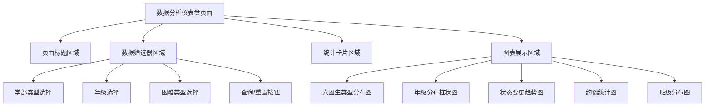

# 隐藏六困生数据分析仪表盘搜索框设计文档

## 1. 概述

本设计文档描述了隐藏六困生数据分析仪表盘最上方搜索框的技术方案。该搜索框位于数据分析仪表盘页面顶部，包含学部类型、年级、困难类型等筛选条件，由于实际使用中发现该功能使用频率较低，决定将其隐藏以简化界面。

### 1.1 项目背景
- **项目类型**: 全栈应用 (Vue3 + Spring Boot)
- **技术栈**: Vue 3 + Element Plus + Spring Boot + MyBatis
- **目标文件**: `/src/views/dmw/dashboard/index.vue`

### 1.2 需求描述
移除六困生数据分析仪表盘页面最上方的数据筛选器组件，该组件包含：
- 学部类型下拉框 (小学部/初中部)
- 年级下拉框 (一年级至九年级)
- 困难类型下拉框 (六种困难类型)
- 查询和重置按钮

## 2. 现状分析

### 2.1 当前界面结构


### 2.2 搜索框组件结构
当前搜索框由以下元素组成：
- **容器**: `<div class="filter-section">`
- **卡片**: `<el-card shadow="never">`
- **表单**: `<el-form :inline="true">`
- **表单项**: 3个下拉选择器 + 1个按钮组

### 2.3 相关代码位置
- **文件路径**: `RuoYi-Vue3-master/src/views/dmw/dashboard/index.vue`
- **代码行数**: 第9-47行 (搜索框模板部分)
- **样式定义**: 第570-633行 (相关CSS样式)

## 3. 技术方案

### 3.1 修改方案
采用**直接移除**方式，完全删除搜索框相关的模板代码、逻辑代码和样式代码。

### 3.2 影响分析

#### 3.2.1 模板层面影响
- 移除 `filter-section` 整个div区域
- 移除相关的Element Plus组件引用
- 移除表单数据绑定

#### 3.2.2 逻辑层面影响
- 保留 `filterForm` 响应式数据结构(用于API调用)
- 保留 `gradeOptions` 数据(可能其他功能需要)
- 移除 `resetFilter` 方法
- 简化 `loadChartData` 方法(移除界面重置逻辑)

#### 3.2.3 样式层面影响
- 移除 `.filter-section` 相关样式
- 移除 `.filter-form` 相关样式
- 调整页面整体布局间距

### 3.3 数据处理保持策略
虽然移除了用户界面的筛选功能，但保留以下内容以确保系统稳定性：
- **后端筛选逻辑**: 保持API接口的筛选参数支持
- **默认数据加载**: 使用空筛选条件加载全量数据
- **数据结构**: 保持 `filterForm` 结构用于API调用

## 4. 实施方案

### 4.1 模板修改
移除以下模板代码块:
```vue
<!-- 数据筛选器 -->
<div class="filter-section">
  <el-card shadow="never">
    <el-form :inline="true" :model="filterForm" class="filter-form">
      <!-- 表单项内容 -->
    </el-form>
  </el-card>
</div>
```

### 4.2 脚本逻辑调整
- 保留 `filterForm` 初始结构用于API调用
- 移除 `resetFilter` 方法定义
- 简化 `loadChartData` 中的加载逻辑

### 4.3 样式清理
移除以下CSS样式:
- `.filter-section` 样式定义
- `.filter-form` 样式定义
- 相关的响应式样式

### 4.4 图标引用清理
移除未使用的Element Plus图标导入:
- `Search` 图标 (查询按钮使用)
- `Refresh` 图标 (重置按钮使用)

## 5. 技术规范遵循

### 5.1 前端组件设计规范
- 遵循项目既定的Vue 3组合式API规范
- 保持Element Plus组件使用的一致性
- 维护响应式设计原则

### 5.2 数据处理规范
- 保持API接口调用的向下兼容性
- 确保图表数据的正常加载和显示
- 维护错误处理和fallback机制

### 5.3 用户界面规范
- 保持界面布局的美观性和一致性
- 确保移除搜索框后的间距协调
- 保持其他功能组件的正常显示

## 6. 测试策略

### 6.1 界面测试
- **布局验证**: 确认移除搜索框后页面布局正常
- **响应式测试**: 验证不同屏幕尺寸下的显示效果
- **样式检查**: 确认没有残留的无用样式

### 6.2 功能测试
- **数据加载**: 验证图表数据正常加载显示
- **交互功能**: 确认其他交互功能不受影响
- **性能表现**: 验证页面加载性能没有异常

### 6.3 兼容性测试
- **浏览器兼容**: 验证主流浏览器的显示效果
- **设备兼容**: 测试桌面端和移动端的适配效果

## 7. 实施步骤

1. **代码修改**: 按照技术方案修改Vue组件文件
2. **样式调整**: 清理无用样式，调整布局间距
3. **功能测试**: 验证数据加载和图表显示功能
4. **界面验证**: 检查页面布局和视觉效果
5. **部署测试**: 在测试环境验证修改效果

此设计文档为隐藏六困生数据分析仪表盘搜索框提供了完整的技术实施方案，确保在简化用户界面的同时保持系统的稳定性和数据完整性。