# 若依管理系统 - 大木湾六困生管理平台 技术文档

## 1. 项目概述

### 系统简介
大木湾六困生管理平台是基于若依(RuoYi)框架构建的学生关爱管理系统，专门用于管理和跟踪"六困生"（六种困难学生）的信息和状态。系统采用前后端分离架构，提供完整的学生信息管理、约谈记录、状态跟踪等功能。

### 核心价值
- **学生关爱数字化**：将传统纸质档案转为数字化管理
- **数据权限精细化**：班主任只能管理自己班级学生，实现数据隔离
- **状态跟踪自动化**：支持学生状态变更的完整记录和统计
- **档案管理标准化**：统一的学生档案格式和导出功能

### 技术版本
- **RuoYi-Vue**: v3.9.0 (Vue 2 + Spring Boot)
- **RuoYi-Vue3**: Vue 3 + Vite 现代化版本

## 2. 技术栈架构

### 后端技术栈
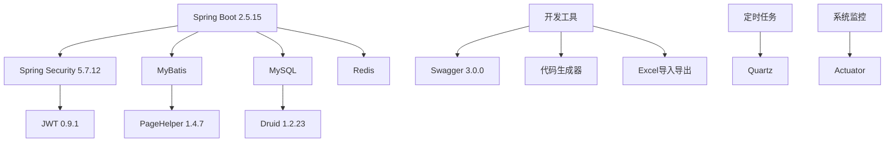

### 前端技术栈

#### Vue 2 版本 (RuoYi-Vue)
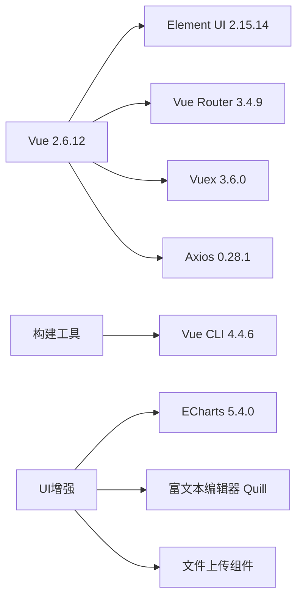

#### Vue 3 版本 (RuoYi-Vue3)
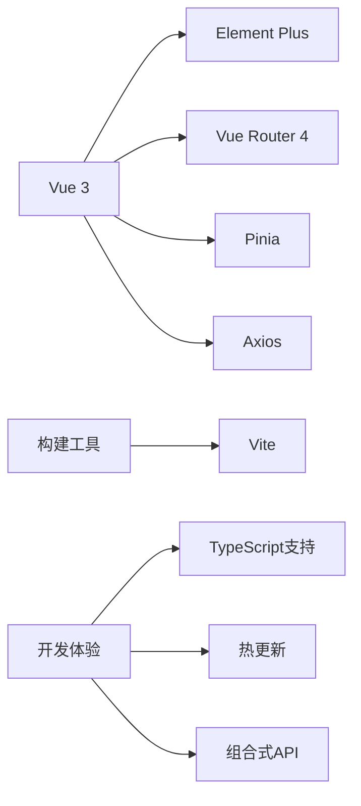

## 3. 系统架构设计

### 整体架构图
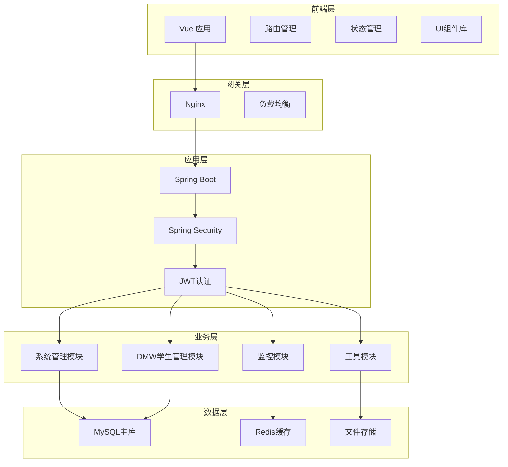

### 模块架构设计

#### 核心模块结构
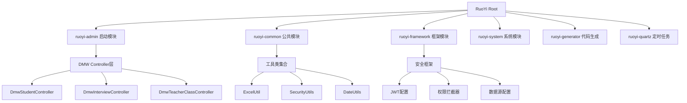

## 4. DMW业务模块详细设计

### 4.1 学生管理模块

#### 数据模型设计
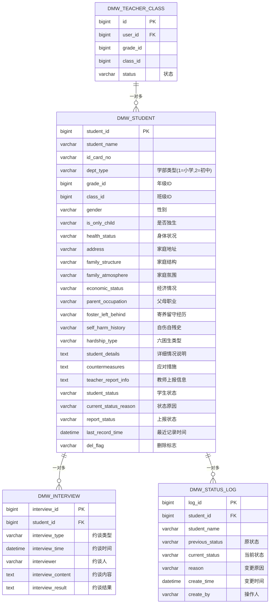

#### 核心业务流程

##### 学生信息管理流程
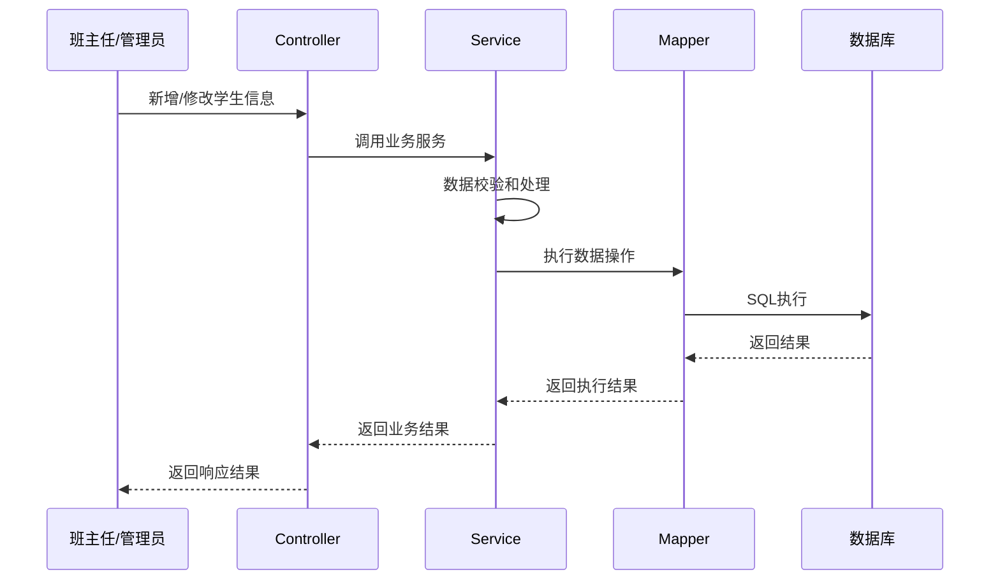

##### 权限控制流程
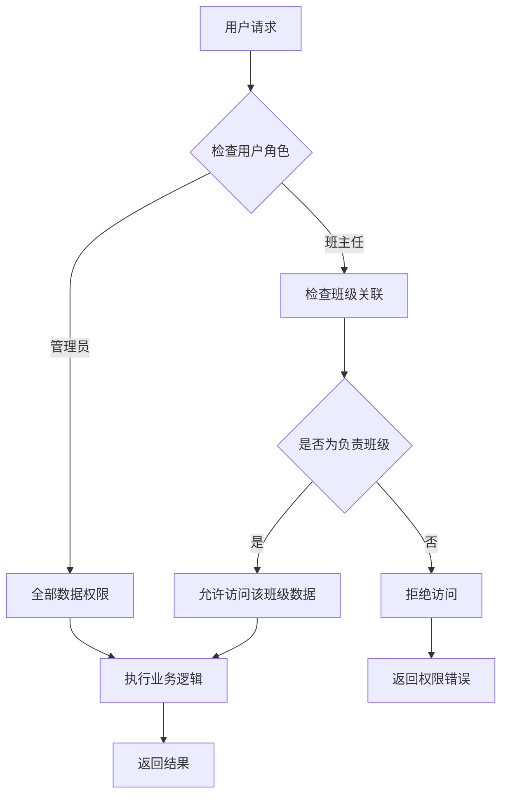

### 4.2 系统功能矩阵

| 功能模块 | 管理员权限 | 班主任权限 | 主要功能 |
|---------|-----------|-----------|----------|
| 学生信息管理 | ✅ 全部学生 | ✅ 负责班级 | CRUD、状态变更、档案下载 |
| 约谈记录管理 | ✅ 全部记录 | ✅ 负责学生 | 新增约谈、查看历史记录 |
| 统计报表 | ✅ 全校统计 | ✅ 班级统计 | 仪表盘、数据导出 |
| 全员升级 | ✅ | ❌ | 年级自动升级、毕业处理 |
| 系统管理 | ✅ | ❌ | 用户、角色、菜单管理 |

### 4.3 API接口设计

#### 学生管理接口
```yaml
# 学生CRUD接口
GET    /dmw/student/list          # 查询学生列表
GET    /dmw/student/{id}          # 获取学生详情
POST   /dmw/student               # 新增学生
PUT    /dmw/student               # 修改学生
DELETE /dmw/student/{ids}         # 删除学生

# 学生状态管理
POST   /dmw/student/changeStatus  # 变更学生状态
GET    /dmw/student/archivedList  # 查询归档学生
PUT    /dmw/student/restore       # 恢复学生档案

# 系统功能接口
POST   /dmw/student/upgradeAll    # 全员升级(管理员)
GET    /dmw/student/dashboard/stats # 获取统计数据
POST   /dmw/student/downloadProfile/{id} # 下载学生档案

# 数据导入导出
POST   /dmw/student/export        # 导出学生数据
POST   /dmw/student/import        # 导入学生数据
GET    /dmw/student/importTemplate # 下载导入模板
```

## 5. 前端组件架构

### 5.1 页面结构设计
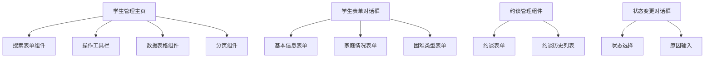

### 5.2 组件通信模式
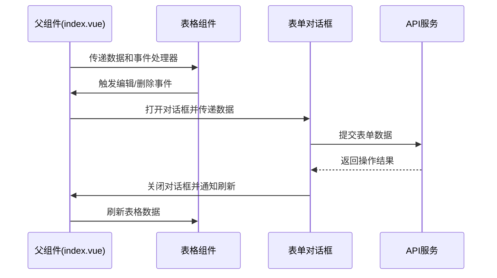

## 6. 数据权限与安全设计

### 6.1 权限控制策略
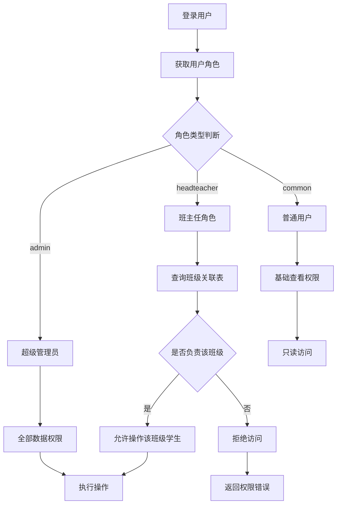

### 6.2 数据安全措施

#### 后端安全控制
- **@PreAuthorize**: 方法级权限控制
- **数据范围过滤**: 基于用户角色自动过滤数据
- **SQL注入防护**: MyBatis参数化查询
- **XSS防护**: 输入数据过滤和转义

#### 前端安全控制
- **路由守卫**: 页面访问权限控制
- **按钮权限**: v-hasPermi指令控制
- **数据脱敏**: 敏感信息显示控制

## 7. 系统监控与运维

### 7.1 系统监控功能
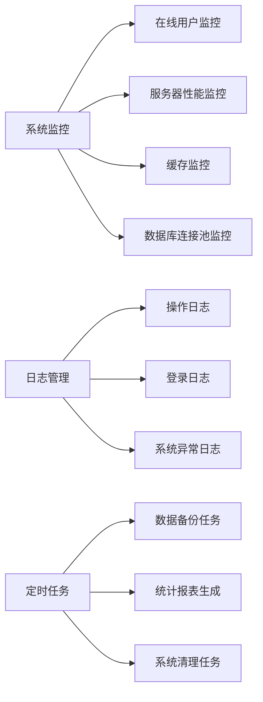

### 7.2 部署架构建议
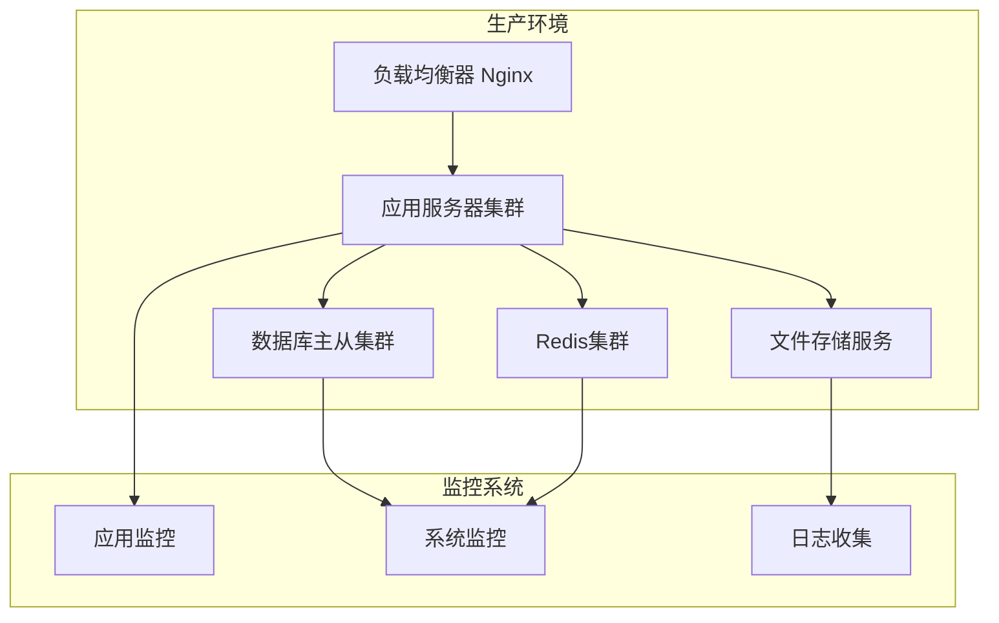

## 8. 开发规范与最佳实践

### 8.1 代码组织规范

#### 后端包结构
```
com.ruoyi.dmw/
├── controller/     # 控制器层
├── service/        # 业务服务层
│   └── impl/      # 服务实现
├── mapper/         # 数据访问层
├── domain/         # 实体模型
└── dto/           # 数据传输对象
```

#### 前端目录结构
```
src/
├── api/dmw/        # API接口定义
├── views/dmw/      # 页面组件
├── components/     # 公共组件
├── store/          # 状态管理
├── router/         # 路由配置
└── utils/          # 工具函数
```

### 8.2 开发最佳实践

#### 数据库设计原则
- 使用软删除(del_flag)而非物理删除
- 记录创建和修改时间、操作人
- 状态变更需要记录变更历史
- 合理使用数据库索引提升查询性能

#### API设计原则
- RESTful API设计风格
- 统一的响应格式(AjaxResult)
- 完善的参数校验和异常处理
- 详细的API文档(Swagger)

#### 前端开发原则
- 组件化开发，提高代码复用性
- 统一的错误处理和消息提示
- 合理的数据缓存策略
- 无障碍访问支持

## 9. 扩展功能建议

### 9.1 功能增强方向
- **移动端适配**: 响应式设计或开发小程序版本
- **数据分析**: 更详细的统计分析和数据可视化
- **消息通知**: 重要事件的消息推送功能
- **文档管理**: 支持更多类型的附件上传和管理
- **工作流程**: 学生状态变更的审批流程

### 9.2 技术优化方向
- **性能优化**: 数据库查询优化、前端组件懒加载
- **安全加固**: 更完善的权限控制和数据加密
- **微服务改造**: 大规模部署时考虑微服务架构
- **容器化部署**: Docker容器化部署方案